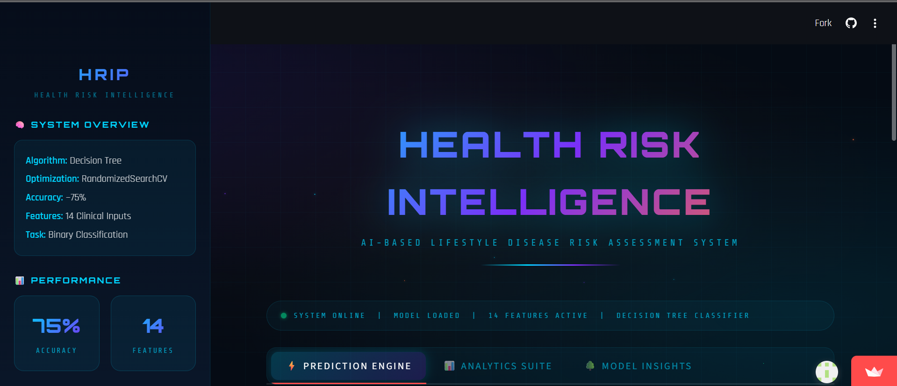
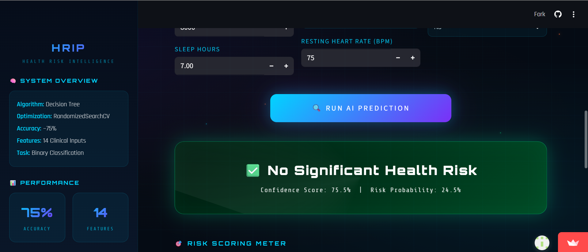
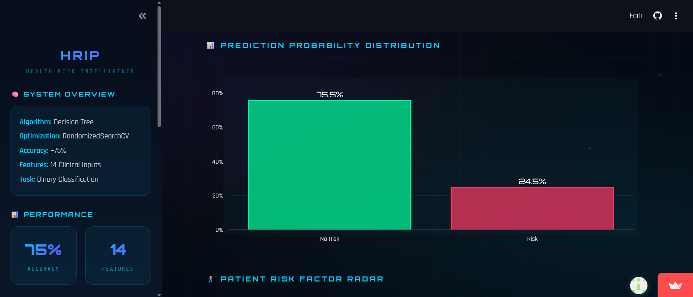
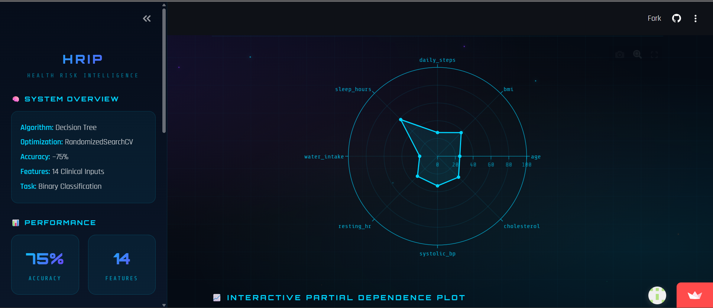

# 🏥 Health Risk Intelligence Platform
AI-Based Lifestyle Disease Risk Assessment System  
Built using Tuned Decision Tree (RandomizedSearchCV)

Deployment Link :- https://health-risk-intelligence-model.streamlit.app/

#Project Images

📁 Dataset Overview

This project uses a Health & Lifestyle Dataset that contains information about individuals' daily habits, physical health, and lifestyle patterns. The dataset is designed to analyze how different lifestyle factors influence overall health and well-being.

It includes a combination of demographic details, health indicators, and behavioral attributes, making it suitable for both data analysis and machine learning applications.

📊 Dataset Summary
| Property      | Value                   |
| ------------- | ----------------------- |
| Dataset Type  | Health & Lifestyle Data |
| Data Type     | Structured (Tabular)    |
| Feature Types | Numerical + Categorical |
| Use Case      | Analysis & Prediction   |

🔑 Key Features

The dataset includes important attributes such as:

Age

Gender

Height & Weight

BMI (Body Mass Index)

Daily Physical Activity

Exercise Frequency

Sleep Duration

Diet Type

Water Intake

Smoking & Alcohol Habits

Stress Levels

Health Condition Indicators

These features help in understanding the relationship between lifestyle choices and health outcomes.

🎯 Objective of the Dataset

The dataset is designed to:

Analyze the impact of lifestyle habits on health

Identify patterns affecting physical fitness and well-being

Support predictive modeling for health risk assessment

Enable data-driven health insights

## 🚀 Project Overview
This project predicts potential health disease risk based on lifestyle, physiological, and behavioral factors using a hyperparameter-optimized Decision Tree Classifier.

It provides:
- 🎯 Risk Prediction
- 📊 Probability Distribution
- 📈 Interactive Partial Dependence Analysis
- 🌳 Decision Tree Visualization
- 📌 Feature Importance Analysis
- ⚙ Best Hyperparameter Insights
- 🌡 Risk Scoring Meter

## 🧠 Machine Learning Details
| Item | Value |
| Algorithm | Decision Tree Classifier |
| Hyperparameter Tuning | RandomizedSearchCV |
| Accuracy | ~75% |
| Features | 14 |
| Output | Binary Risk Classification |

## 📊 Features Used
- Age
- Gender
- BMI
- Daily Steps
- Sleep Hours
- Water Intake
- Calories Consumed
- Smoker
- Alcohol
- Resting Heart Rate
- Systolic BP
- Diastolic BP
- Cholesterol
- Family History

## 📈 Application Sections

### 1️⃣ Prediction Tab
- User enters lifestyle details
- Model predicts risk
- Confidence score displayed
- Risk Gauge visualization

### 2️⃣ Analytics Tab
- Probability distribution chart
- Interactive Partial Dependence Plot

### 3️⃣ Model Insights Tab
- Full Decision Tree visualization
- Feature importance ranking
- Best hyperparameters display

## 🛠 Tech Stack
- Python
- Streamlit
- Scikit-Learn
- Plotly
- Matplotlib
- Pandas
- NumPy

## ▶️ How To Run Locally
git clone https://github.com/akshitgajera1013/Health-Risk-Intelligence.git

cd Health-Risk-Intelligence   

pip install -r requirements.txt

streamlit run app.py
